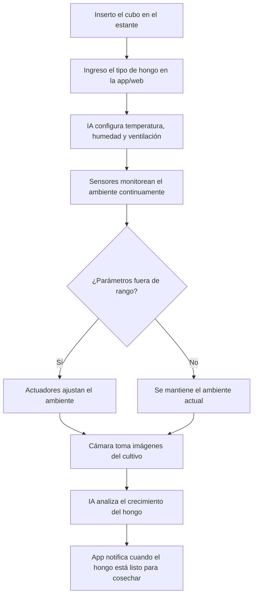

```mermaid
flowchart TD
    A[Inserto el cubo en el estante] --> B[Ingreso el tipo de hongo en la app/web]
    B --> C[IA configura temperatura, humedad y ventilación]
    C --> D[Sensores monitorean el ambiente continuamente]
    D --> E{¿Parámetros fuera de rango?}
    E -- Sí --> F[Actuadores ajustan el ambiente]
    E -- No --> G[Se mantiene el ambiente actual]
    F --> H[Cámara toma imágenes del cultivo]
    G --> H
    H --> I[IA analiza el crecimiento del hongo]
    I --> J[App notifica cuando el hongo está listo para cosechar]
```

