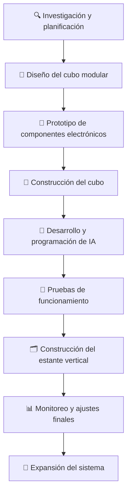

```mermaid
graph TD
    A[🔍 Investigación y planificación] --> B[📐 Diseño del cubo modular]
    B --> C[🔧 Prototipo de componentes electrónicos]
    C --> D[🧱 Construcción del cubo]
    D --> E[🧠 Desarrollo y programación de IA]
    E --> F[🧪 Pruebas de funcionamiento]
    F --> G[🗂️ Construcción del estante vertical]
    G --> H[📊 Monitoreo y ajustes finales]
    H --> I[🌱 Expansión del sistema]
```
